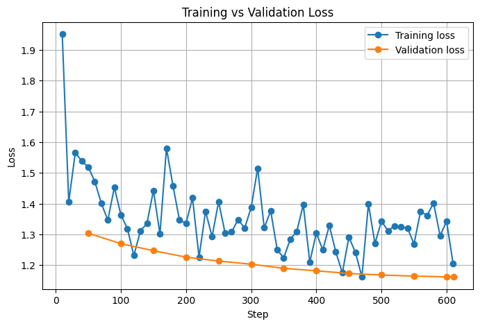
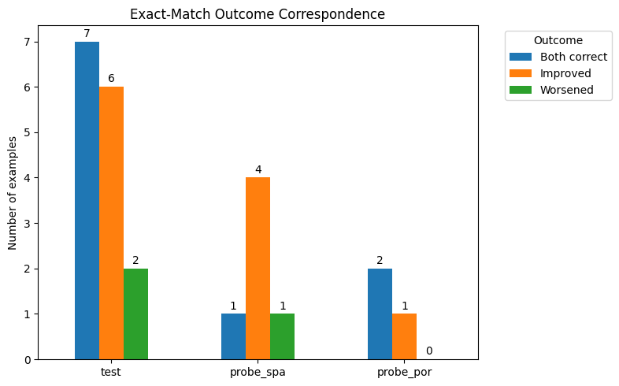
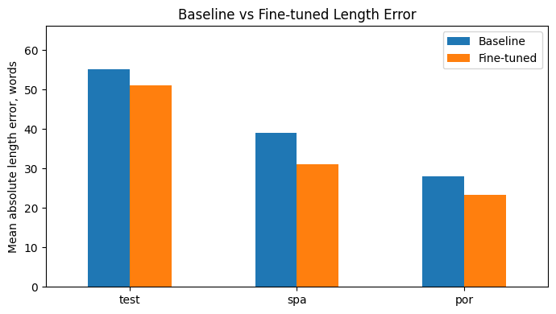
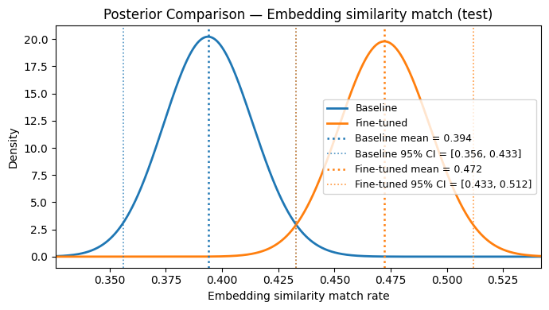
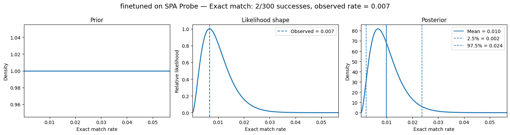

# Multilingual Fine-Tuning of a Small Language Model

This project explores whether a small instruction-tuned language model can be adapted toward better multilingual answering through supervised fine-tuning.

The goal is not simply to obtain a higher benchmark score, but to build a controlled fine-tuning and evaluation pipeline: prepare multilingual data, evaluate the baseline model, fine-tune with parameter-efficient adapters, and compare the model before and after training across target and probe languages.

Repository: `Multilingual-Finetuning-Language-Model`

---

## Project Motivation

Large language models often perform unevenly across languages. Even when a model is generally capable, its responses may become longer, less precise, or less reliable in languages that are underrepresented during training.

This project investigates multilingual fine-tuning as an "attribute shift": the fine-tuned model is not expected to become universally smarter, but rather to change its behavior on a specific set of language tasks.

The main questions are:

- Can a small open instruction model improve on multilingual question-answering after supervised fine-tuning?
- Does the fine-tuned model become more target-like and concise?
- Does training on selected languages generalize to related unseen languages?
- Are there tradeoffs, such as examples where the fine-tuned model performs worse than the baseline?

---
## Results

### Training Loss



### Improved and worsened examples




### Response length comparison




### Semantic Similaroty Posterior comparison



### Unseen Language Bayesian Analysis 



---

---

## Repository Structure

```text
.
├── data/
│   └── processed datasets and splits
│
├── notebooks/
│   ├── 1_download_refine_data.ipynb
│   ├── 2_versatile_model_eval.ipynb
│   ├── 3_finetune_model.ipynb
│   └── 4_compare_results.ipynb
│
├── .gitignore
└── README.md
